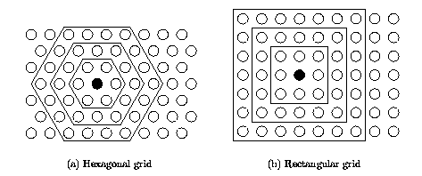
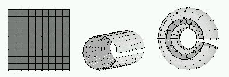
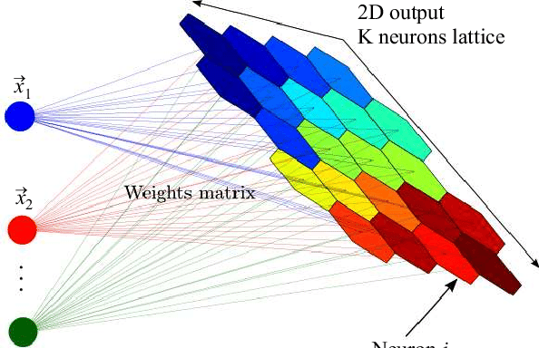
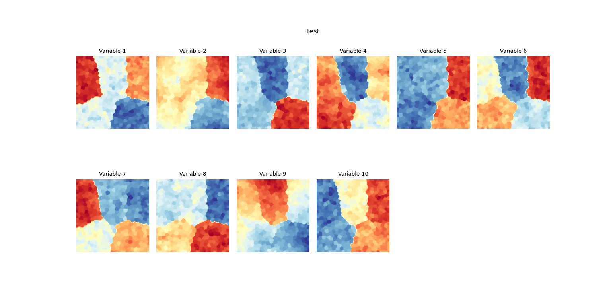
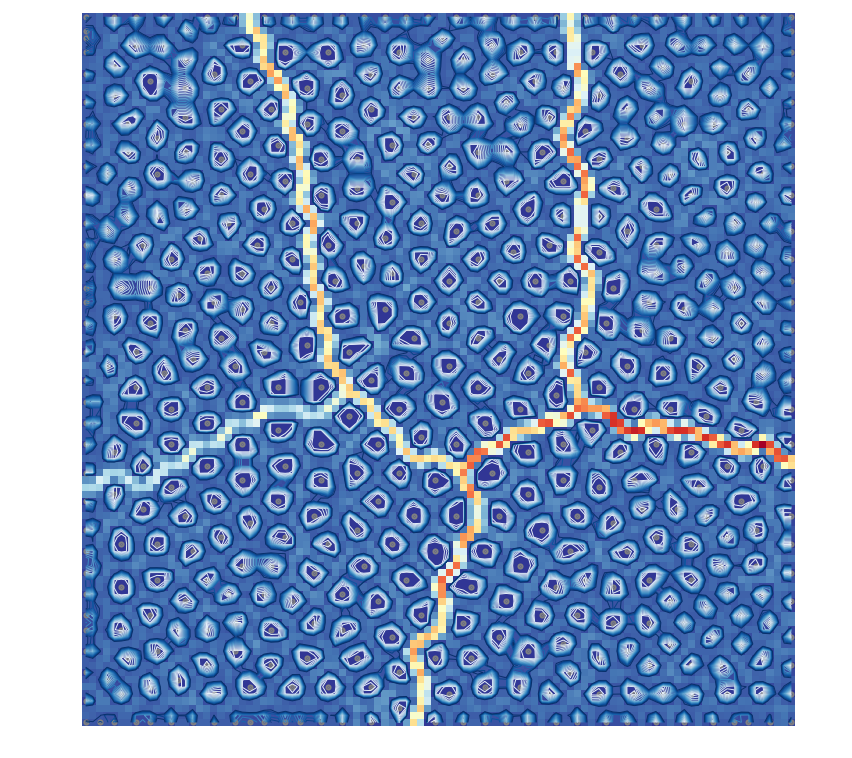

Self organising maps or kohonen networks provide a way of representing multi-dimentional data in much lower dimentional space, usually 1 or 2 dimentions. It's also a data compression technique known as vector quantisation. In addition the SOM can be used as a method of storing information in such a way that any topological relationships within the training data set is manitained. (Topology deals with the spatial and structural properties of geometric data). Hence it's in a way advantageous compared to K-means, because it can preserve and display a clear visualization of the data. Therefore it can be used to get an idea of how many clusters the dataset can be sub divided into.

A SOM is made of neurons located on a regular, usually 1 to 2 dimentional grid. (Higher dimentional grids are possible, but they are not generally used since their visualization is much more difficult). The neurons are connected to adjacent neurons by a neighbourhood relation dictating the structure of the map. In 2 dimentional case the structure can be rectangualr or hexagonal. The sides of the map can also be connected, in that case the shape becomes a cylinder or a toroid. 





Let's understand how the map works, 

Each unit is associated with weight vector (or codebook vector) W<sub>i</sub>  which is of the same dimention as the input data. 



The codebook vectors W<sub>i</sub> must be initiated with values similar to those of the input data. During the training of the map the input vectors are presented to the map consecutively. The unit with a codebook vector W<sub>i</sub> that sohows the smallest distance to the input vector X is declared as the best matching unit(BMU). You can view the best matching units with the hits map. This process is known as so called vector quantization.
The codebook vectors are unpdated via following equation, 

**W<sub>i</sub><sup>t+1</sup> = W<sub>i</sub><sup>t</sup> + h<sub>ci</sub><sup>t</sup>x A<sup>t</sup> x d(X,W<sub>i</sub><sup>t</sup>)**

here c means the codebook vector

Where t is a point in time. 
h<sub>ci</sub><sup>t</sup> is a neighbourhood function
A<sup>t</sup> is a learning rate

d(X,W<sub>i</sub><sup>t</sup>) is the distance between an input vector X and the codebook vector W<sub>i</sub>

Both A<sup>t</sup> and h<sub>ci</sub><sup>t</sup> lie within the interval [0,1] and discrete by time.  The neighbouring function h<sub>ci</sub><sup>t</sup> is defined by the topological or geometrical relationship between W<sub>i</sub><sup>t</sup> and the codebook vector W<sub>c</sub><sup>t</sup> of the BMU. 
After n training cycles the values of the codebook vectors W<sup>n</sup> will represent the distribution of the input vectors. 

To have a idea of the data set being analyzed we need to visualize the codebook vectors. There are several ways we can do that, and each way of visualizing gives different view of the dataset. 

**Visualization of the Codebook Vectors**

The codebook vectors tend to be closer to each other in the areas where they represent input vecotrs which are distributed tensly and vice versa the distance between the codebook vectors are large in areas where there is a sparse distribution of input vectors. 

Let's generate some data first and reperesent them in following visaualizations as the expalnation goes, 
Here we'll be using the library created by Vahid Moosavi for SOM. 

We'll use dataset with 10 dimentions with 5 cluster centers which we can't visualize in normal ways of cartesian graphs.  
```python
from sklearn.datasets import make_blobs
import matplotlib.pyplot as plt

X, y = make_blobs(n_samples=500,
                  n_features=10,
                  centers=5,
                  cluster_std=1,
                  center_box=(-10.0, 10.0),
                  shuffle=True,
                  random_state=1)

print(X) #outputs a dataset with 2 features and 500 samples
print(y) #outputs cluster labes for 500 samples

plt.scatter(X[:,0],X[:,1],marker = "x", s= 12)
plt.show()
```      

**Component Planes :** 
  This shows the relative values of the components of the codebook vectors. Therefore the number of component palnes per SOM is eqaul to the number of input vector's dimentionality. Component planes can be thought of as a sliced version of the SOM. Each component plane has the relative distribution of one data vector component. 
  In this representation, dark values represent relatively small values while white values represent relatively large values. By compairing component planes we can have an idea of the correlation between the input vector components. If the outlook pattern and colors are similar, the components strongly correlate. 
  
 
 
 Code for the above visualization, 
 ```python
 import pandas as pd
import numpy as np
from time import time
import sompy

#Creating and Training the Kohonen Network

mapsize = [100,100]
som = sompy.SOMFactory.build(X, mapsize, mask=None, mapshape='planar', lattice='rect', normalization='var', initialization='pca', neighborhood='gaussian', training='batch', name='sompy')  # this will use the default parameters, but i can change the initialization and neighborhood methods
som.train(n_job=1, verbose='info')  # verbose='debug' will print more, and verbose=None wont print anything

#Visualizing the component planes of the trained Kohonen Network

v = sompy.mapview.View2DPacked(100, 100, 'test',text_size=8)  
# could be done in a one-liner: sompy.mapview.View2DPacked(300, 300, 'test').show(som)
v.show(som, what='codebook', which_dim='all', cmap=None, col_sz=6) #which_dim='all' default
# v.save('2d_packed_test')
```
  
**U - Matrix :**
  This figure shows the relative distances between the neurons in the map. Here the distance between the adjacent neurons is calculated and presented with different colorings between the adjacent nodes. 
  The light colouring between the neurons corresponds to a large distance between the codebook vectors and hence in the input space too, and the dark colors indicates that the codebook vecotrs are closer to each other. Therefore dark areas can be though of as clusters and light coloured areas as cluster seperators. This representation is helpful when one tries to find the clusters in the input data without having any priori information about the clusters. 



Codes for the above visualization, 

```python
#include the libraries needed as above

u = sompy.umatrix.UMatrixView(100, 100, 'umatrix', show_axis=True, text_size=8, show_text=True)

#This is the Umat value
UMAT  = u.build_u_matrix(som, distance=1, row_normalized=False)

#Here you have Umatrix plus its render
UMAT = u.show(som, distance2=1, row_normalized=False, show_data=True, contooor=True, blob=False)
```
The hits map shows the units that has chosen as BMUs, 


Codes for the above visualization, 

```python
from sompy.visualization.bmuhits import BmuHitsView

vhts  = BmuHitsView(100,100,"Hits Map",text_size=1)
vhts.show(som, anotate=True, onlyzeros=False, labelsize=4, cmap="Greys", logaritmic=False)
```

(Here we have used the SOMPY library created by Vahid Moosavi.)

